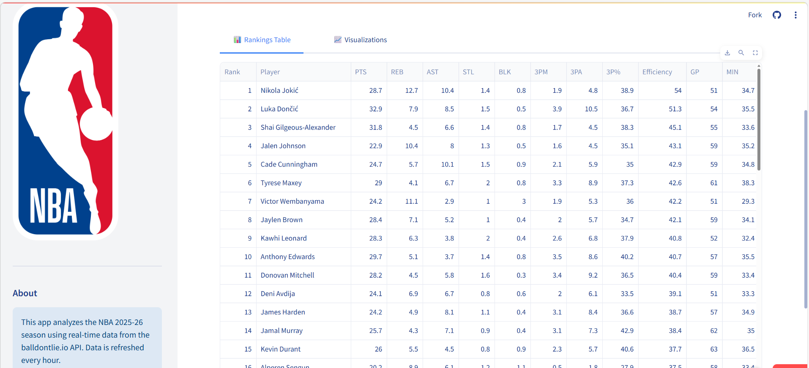
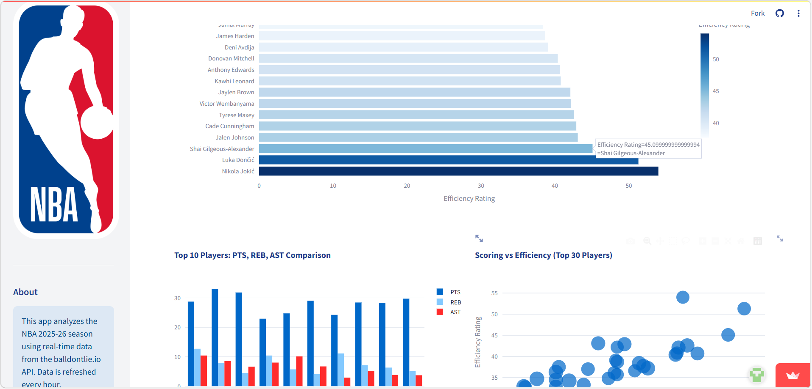

NBA Data Analyzer is an interactive analytics dashboard built with Python and Streamlit that explores NBA player performance through rankings, efficiency metrics, projections, and visualizations.

The application retrieves live league data, calculates derived statistics such as scoring efficiency and three-point performance, and presents the results through an interactive browser interface. The goal of the project is to demonstrate how a lightweight data pipeline can transform raw sports data into meaningful analytical insights.

## Dashboard Preview

### Player Statistics

### Performance Charts

Live Demo

You can try the live application here:

Launch the App

https://nba-data-az48in6pu8ndseqnnyrnj7.streamlit.app/

Features

Player rankings based on efficiency and core box-score metrics

Interactive visualizations for scoring distribution, efficiency trends, and three-point shooting

Season projection tools for estimating player outcomes and milestone pacing

Configurable filters for minimum games played and number of results displayed

Cached data retrieval to reduce API calls and improve UI responsiveness

Modular analytics pipeline separating data ingestion, processing, projections, and presentation

Tech Stack

Language

Python

Data Processing

Pandas

NumPy

Visualization & UI

Streamlit

Data Source

NBA statistics API

Testing

Python-based component testing

System Architecture

The application follows a modular analytics pipeline that separates data ingestion, statistical computation, projections, and presentation.

NBA API
   ↓
data_fetcher.py
   ↓
stats_calculator.py
   ↓
projections.py
   ↓
app.py (Streamlit dashboard)

Module Responsibilities

data_fetcher.py

Retrieves player statistics from the NBA data source and normalizes the dataset for downstream processing.

stats_calculator.py

Computes derived metrics including efficiency rankings, scoring statistics, and player comparisons.

projections.py

Implements projection utilities used to estimate season outcomes and milestone pacing.

app.py

The Streamlit presentation layer responsible for rendering tables, visualizations, dashboards, and user controls.

config.py

Centralized configuration for runtime constants such as cache duration, display limits, and threshold settings.

Application Flow

Fetch and cache player data from the NBA data source

Compute efficiency metrics and player rankings

Apply projection models and milestone calculations

Render tables, KPIs, and visual analytics within the Streamlit interface

Setup
Prerequisites

Python 3.8+

Windows PowerShell or Command Prompt

Option A — PowerShell
.\start.ps1

Option B — Command Prompt
start.bat

Option C — Manual Setup
python -m venv .venv
.\.venv\Scripts\Activate.ps1
python -m pip install -r requirements.txt
streamlit run app.py

Usage

After startup, open:

http://localhost:8501

if the browser does not launch automatically.

Use the sidebar controls to:

Set the number of players displayed

Configure minimum games played

Refresh cached data

Navigate between tabs to explore:

Player rankings

Visual analytics and charts

Configuration

Runtime settings are defined in config.py, including:

Cache TTL

Default display limits

Minimum games threshold

Season length assumptions

Milestone thresholds used in projections

Updating these values allows you to tune application behavior without modifying the core analytics modules.

Testing

Run the lightweight component smoke test:

python test_app.py

This validates:

Module initialization

Core calculation paths

Ranking and projection execution with sample data

Deployment

The application can be deployed using Streamlit Community Cloud.

Deployment Steps

Push the repository to GitHub

Create a new Streamlit app linked to the repository

Set the entry point to app.py

Configure environment variables or secrets if required

Deploy and verify data retrieval and chart rendering

Why I Built This

I built this project to explore how sports data can be transformed into meaningful insights using Python analytics tools. The goal was to design a lightweight but structured pipeline that retrieves live data, computes derived statistics, and presents the results through an interactive dashboard.

This project helped me practice building modular data pipelines, working with real-world datasets, and developing interactive analytical applications.

Contribution Guidelines

Create a feature branch from main

Keep changes focused and testable

Add or update tests when modifying logic

Run python test_app.py before opening a PR

Submit a pull request including:

A clear summary of changes

Rationale and impact

Screenshots for UI updates

License

MIT License

Author

Daniel Dziewit GitHub: https://github.com/dandziewit

